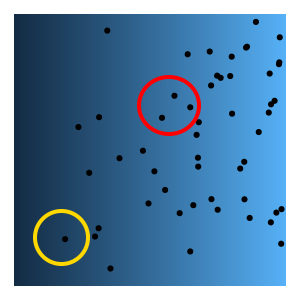
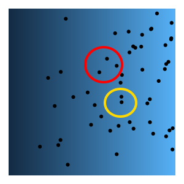
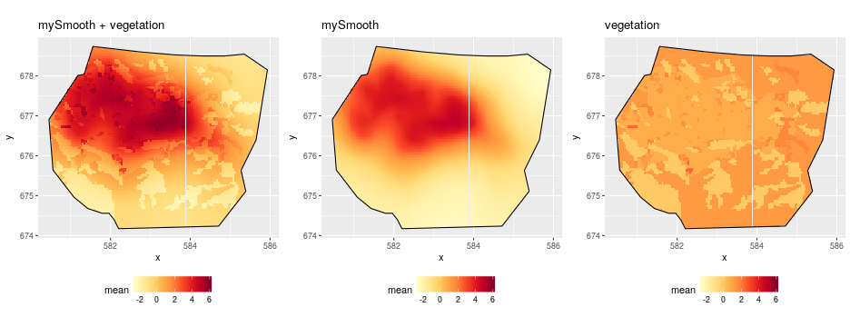

```{r setup, include=FALSE}
options(htmltools.dir.version = FALSE)
knitr::opts_chunk$set(cache = TRUE)

# Spatstat datasets
library(spatstat)
data(cells)

# Simulate from random fields
library(RandomFields)

# Plotting
library(ggplot2)

# Gorillas Gorillas Gorillas
library(inlabru)

set.seed(1234)

```

class: center

# Introduction to Point Processes

```{r, echo=FALSE, fig.height=6, fig.width=8}
op <- par(mfrow = c(1,1))
par(mfrow = c(1,2),
    mar = c(0.1,0.1,0.1,0.1))
plot(cells, main = "")
plot(rpoispp(cells$n, win = cells$window), main = "")
par(op)
```

---

# Poisson Point Process

The intensity function $\lambda(s)$ is the heart of point process models.

Here is one realisation:

```{r echo = FALSE, fig.height = 5, fig.width = 5, fig.align='center'}

# Gradient example
grad_lambda <- function(x,y) 100*x 
grad_pp <- rpoispp(grad_lambda, win = cells$window)
pp_df <- data.frame(x = grad_pp$x, y = grad_pp$y)

xs <- seq(0, 1, length.out = 200)
ys <- seq(0, 1, length.out = 200)
df <- as.data.frame(expand.grid(x = xs, y = ys))
df$lambda <- grad_lambda(xs,ys)
ggplot() + 
  geom_tile(data = df, aes(x=x,y=y, fill = lambda)) +
  geom_point(data = pp_df, aes(x=x, y=y)) +
  theme_void() +
  guides(fill = FALSE)


```

---

# Poisson Point Process

The intensity function $\lambda(s)$ is the heart of point process models.

And another:

```{r echo = FALSE, fig.height=5, fig.width=5, fig.align='center'}

# Gradient example
grad_lambda <- function(x,y) 100*x 
grad_pp <- rpoispp(grad_lambda, win = cells$window)
pp_df <- data.frame(x = grad_pp$x, y = grad_pp$y)

xs <- seq(0, 1, length.out = 200)
ys <- seq(0, 1, length.out = 200)
df <- as.data.frame(expand.grid(x = xs, y = ys))
df$lambda <- grad_lambda(xs,ys)
ggplot() + 
  geom_tile(data = df, aes(x=x,y=y, fill = lambda)) +
  geom_point(data = pp_df, aes(x=x, y=y)) +
  theme_void() +
  guides(fill = FALSE)


```

---

# Poisson Point Process

The intensity function $\lambda(s)$ is the heart of point process models.

And another another:

```{r echo = FALSE, fig.height=5, fig.width=5, fig.align='center'}

# Gradient example
grad_lambda <- function(x,y) 100*x 
grad_pp <- rpoispp(grad_lambda, win = cells$window)
pp_df <- data.frame(x = grad_pp$x, y = grad_pp$y)

xs <- seq(0, 1, length.out = 200)
ys <- seq(0, 1, length.out = 200)
df <- as.data.frame(expand.grid(x = xs, y = ys))
df$lambda <- grad_lambda(xs,ys)
ggplot() + 
  geom_tile(data = df, aes(x=x,y=y, fill = lambda)) +
  geom_point(data = pp_df, aes(x=x, y=y)) +
  theme_void() +
  guides(fill = FALSE)


```

---

# Poisson Point Process

- The intensity $\lambda(s)$ determines where points are more/less likely to occur

--

- The **expected** number of points in a region $B$ is $\Lambda_B = \int_B \lambda(s) ds$

--

- The number of points is a random variable $N(B) \sim Pois(\Lambda_B)$ 

---

# Poisson Point Process

- KEY ASSUMPTION:   disjoint regions are independent, conditional on $\lambda(s)$

--

 

---

# Poisson Point Process

- KEY ASSUMPTION:   disjoint regions are independent, conditional on $\lambda(s)$

 

--

- So your model for $\lambda(s)$ better be really good

--

- We usually model $\log \lambda(s) = \text{Intercept} + \text{Spatial Covariates}$

---

# Poisson Point Process

A not so good $\lambda(s)$ model:

```{r, echo = FALSE, fig.height=5, fig.width=5, fig.align='center'}
hill_lambda <- function(x,y) (x - 0.5)^2 + (y - 0.5)^2
lambda2 <- function(x,y) grad_lambda(x,y) + 300*hill_lambda(x,y)

set.seed(123)
pp2 <- rpoispp(lambda2, win = cells$window)
pp_df <- data.frame(x = pp2$x, y = pp2$y)

xs <- seq(0, 1, length.out = 200)
ys <- seq(0, 1, length.out = 200)
df <- as.data.frame(expand.grid(x = xs, y = ys))
df$lambda <- grad_lambda(xs,ys)
ggplot() + 
  geom_tile(data = df, aes(x=x,y=y, fill = lambda)) +
  geom_point(data = pp_df, aes(x=x, y=y)) +
  theme_void() +
  guides(fill = FALSE)

```

---

# Poisson Point Process

The true intensity looks like this

```{r, echo = FALSE, fig.height=5, fig.width=5, fig.align='center'}
df$lambda <- lambda2(xs,ys)
ggplot() + 
  geom_tile(data = df, aes(x=x,y=y, fill = lambda)) +
  geom_point(data = pp_df, aes(x=x, y=y)) +
  theme_void() +
  guides(fill = FALSE)

```

--

- but we don't know this, all we have are some covariates that get us some of the picture

---

# Poisson Point Process

What are the consequences of having a bad model for $\lambda(s)$?

--

- Still some dependence in the observations, breaks model assumptions and can lead to **"spurious significance"**

--

- Model will extrapolate poorly to new areas or time periods

--

What can I do?

--

- If you have good reason to suspect a covariate you are missing will be useful, try to collect it (easier said than done...)

--

- Could be a dependence that no covariate could ever capture (e.g. sociality, seed dispersal limitation)

--

- If no covariate - consider spatially structured random effect (Gaussian Process in the this talk)

---

# Introduction to Gaussian Processes

--

We want something in our model that tries to fill the place of a missing covariate

--

(not quite, e.g. sociality, but not a bad way to think at first)

--

- Gaussian Processes define probability distributions for **functions**

--

- In our case, the function will act like a spatial covariate $f(s)$

--

- We write $f \sim \mathcal{GP}(\mu, \kappa)$

--

- $\mu$ is a mean function

--

- $\kappa$ is a covariance function (more on this later)

---

# Introduction to Gaussian Processes

Some realisations of 1D Gaussian Process:

```{r, echo = FALSE, warning = FALSE, message = FALSE, results = FALSE}
# Set up model
model <- RMexp(var=2, scale=10) + RMtrend(mean=0)
from <- 0
to <- 20
x.seq <- seq(from, to, length=200)
```


```{r, echo = FALSE, fig.width = 5, fig.height = 5, fig.align='center', message = FALSE}
simu <- RFsimulate(model, x=x.seq)
df <- data.frame(x = x.seq, y = simu@data$variable1)
ggplot(df) +
  geom_line(aes(x=x, y =y)) +
  ylim(c(-5,5)) +
  xlab("s") + 
  ylab("f")
```

---

# Introduction to Gaussian Processes

Some realisations of 1D Gaussian Process:

```{r, echo = FALSE, fig.width = 5, fig.height = 5, fig.align='center', message = FALSE}
simu <- RFsimulate(model, x=x.seq)
df <- data.frame(x = x.seq, y = simu@data$variable1)
ggplot(df) +
  geom_line(aes(x=x, y =y)) +
  ylim(c(-5,5)) +
  xlab("s") + 
  ylab("f")
```

---

# Introduction to Gaussian Processes

Some realisations of 1D Gaussian Process:

```{r, echo = FALSE, fig.width = 5, fig.height = 5, fig.align='center', message = FALSE}
simu <- RFsimulate(model, x=x.seq)
df <- data.frame(x = x.seq, y = simu@data$variable1)
ggplot(df) +
  geom_line(aes(x=x, y =y)) +
  ylim(c(-5,5)) +
  xlab("s") + 
  ylab("f")
```

---

# Introduction to Gaussian Processes

Some realisations of 1D Gaussian Process:

```{r, echo = FALSE, fig.width = 5, fig.height = 5, fig.align='center', message = FALSE}
simu <- RFsimulate(model, x=x.seq)
df <- data.frame(x = x.seq, y = simu@data$variable1)
ggplot(df) +
  geom_line(aes(x=x, y =y)) +
  ylim(c(-5,5)) +
  xlab("s") + 
  ylab("f")
```

---

# Introduction to Gaussian Processes

The covariance function controls the ruggedness

--

Previous slides had $f \sim \mathcal{GP}(\mu = 0, \kappa = \text{exponential model})$

--

$\kappa(s_1, s_2) = \exp(-r(s_1, s_2))$

where $r(s_1,s_2)$ is distance between $s_1$ and $s_2$

--

We can include a parameter to control the **correlation range**

---

# Introduction to Gaussian Processes

```{r, echo = FALSE, fig.align= 'center', fig.width=7, fig.asp = 0.8}
# Exp correlation fn
cexp <- function(r, scale) exp(-1/(2*scale)*r)

sc10 <- 10
df10 <- data.frame(x = x.seq, cexp = cexp(x.seq, sc10))

sc4 <- 4
df4 <- data.frame(x = x.seq, cexp = cexp(x.seq, sc4))

sc1 <- 1
df1 <- data.frame(x = x.seq, cexp = cexp(x.seq, sc1))

p1 <- ggplot() +
  geom_line(data = df10, aes(x=x, y=cexp, colour = "black")) +
  geom_line(data = df4, aes(x=x, y=cexp, colour = "red")) +
  geom_line(data = df1, aes(x=x, y=cexp, colour = "blue")) +
  scale_colour_manual(name = "",
                      values = c("black", "red", "blue"),
                      labels = c("scale = 10", "scale = 1", "scale = 4")) +
  xlab("r") +
  ylab(expression(paste(kappa, "(r)"))) +
  ggtitle("Exponential covariance function")
```

```{r, echo = FALSE, fig.align= 'center', fig.width=10, fig.asp = 0.5, message = FALSE}
# Simulate now from 3 different correlation ranges
m10 <- RMexp(var=2, scale=sc10) + RMtrend(mean=0)
m4 <- RMexp(var=2, scale=sc4) + RMtrend(mean=0)
m1 <- RMexp(var=2, scale=sc1) + RMtrend(mean=0)

set.seed(123)
sim10 <- RFsimulate(m10, x=x.seq)
sim4 <- RFsimulate(m4, x=x.seq)
sim1 <- RFsimulate(m1, x=x.seq)

dfs10 <- data.frame(x = x.seq, y = sim10@data$variable1)
dfs4 <- data.frame(x = x.seq, y = sim4@data$variable1)
dfs1 <- data.frame(x = x.seq, y = sim1@data$variable1)
p2 <- ggplot() +
  geom_line(data = dfs10, aes(x=x, y=y, colour = "black")) +
  geom_line(data = dfs4, aes(x=x, y=y, colour = "orange")) +
  geom_line(data = dfs1, aes(x=x, y=y, colour = "blue")) +
  scale_colour_manual(values = c("black", "red", "blue"),
                      labels = c("scale = 10", "scale = 1", "scale = 4")) +
  xlab("s") +
  ylab("f")

inlabru::multiplot(p1, p2, cols = 2)
```

--

- Can make realisations smoother by using Matern covariance model

--

- Exponential model is special case of Matern (not very smooth case)

---

# 2D Matern Examples

```{r, echo = FALSE, message = FALSE, warning = FALSE, fig.align = 'center', fig.width=6, fig.height=6}
x <- seq(0, 20, len=250)
scl <- 2
model <- RMwhittle(nu=1, var = 1, scale = scl)
z <- RFsimulate(model=model, x, x)
z <- sp::SpatialGridDataFrame(z@grid, z@data)
plot(z, main = paste("scale = ", scl))
```

---

# 2D Matern Examples

```{r, echo = FALSE, message = FALSE, warning = FALSE, fig.align = 'center', fig.width=6, fig.height=6}
x <- seq(0, 20, len=250)
scl <- 2
model <- RMwhittle(nu=1, var = 1, scale = scl)
z <- RFsimulate(model=model, x, x)
z <- sp::SpatialGridDataFrame(z@grid, z@data)
plot(z, main = paste("scale = ", scl))
```

---


# 2D Matern Examples

```{r, echo = FALSE, message = FALSE, warning = FALSE, fig.align = 'center', fig.width=6, fig.height=6}
x <- seq(0, 20, len=250)
scl <- 2
model <- RMwhittle(nu=1, var = 1, scale = scl)
z <- RFsimulate(model=model, x, x)
z <- sp::SpatialGridDataFrame(z@grid, z@data)
plot(z, main = paste("scale = ", scl))
```

---


# 2D Matern Examples

```{r, echo = FALSE, message = FALSE, warning = FALSE, fig.align = 'center', fig.width=6, fig.height=6}
x <- seq(0, 20, len=250)
scl <- 10
model <- RMwhittle(nu=1, var = 1, scale = scl)
z <- RFsimulate(model=model, x, x)
z <- sp::SpatialGridDataFrame(z@grid, z@data)
plot(z, main = paste("scale = ", scl))
```

---

# 2D Matern Examples

```{r, echo = FALSE, message = FALSE, warning = FALSE, fig.align = 'center', fig.width=6, fig.height=6}
x <- seq(0, 20, len=250)
scl <- 10
model <- RMwhittle(nu=1, var = 1, scale = scl)
z <- RFsimulate(model=model, x, x)
z <- sp::SpatialGridDataFrame(z@grid, z@data)
plot(z, main = paste("scale = ", scl))
```

---

# 2D Matern Examples

```{r, echo = FALSE, message = FALSE, warning = FALSE, fig.align = 'center', fig.width=6, fig.height=6}
x <- seq(0, 20, len=250)
scl <- 10
model <- RMwhittle(nu=1, var = 1, scale = scl)
z <- RFsimulate(model=model, x, x)
z <- sp::SpatialGridDataFrame(z@grid, z@data)
plot(z, main = paste("scale = ", scl))
```

---

# Putting it all together


$$
\begin{aligned}
\log \lambda(s) &= \text{Intercept} + \text{Spatial Covariates} \\[20pt]
\mathbb{E}(N(B)) &= \Lambda_B = \int_B \lambda(s) ds \qquad \text{(Not a random variable}) \\[20pt]
N(B) &\sim Pois(\Lambda_B)
\end{aligned}
$$

---

# Putting it all together


$$
\begin{aligned}
\log \lambda(s) &= \text{Intercept} + \text{Spatial Covariates} + \mathcal{GP}(\mu = 0, \text{Matern}) \\[20pt]
\mathbb{E}(N(B)) &= \Lambda_B = \int_B \lambda(s) ds \qquad \text{(IS a random variable}) \\[20pt]
N(B) &\sim Pois(\Lambda_B)
\end{aligned}
$$
--

Now the Poisson rate parameter is allowed to be random.

--

c.f.  Negative-binomial distribution


---

# An example

Can fit these models using `inlabru`   (see inlabru.org for 5-day workshop materials)

```{r, echo = FALSE, results = FALSE, message = FALSE}
# Load gorillas data
data(gorillas)
init.tutorial()
nests = gorillas$nests
mesh = gorillas$mesh
boundary = gorillas$boundary
gcov = gorillas$gcov
```

```{r, echo = FALSE, message= FALSE, fig.align='center', fig.height=6, fig.width=6}
# Plot the nests
ggplot() +
  gg(mesh) +
  gg(boundary) +
  gg(nests) +
  ggtitle("Gorilla Nests") +
  coord_equal()
  

```


---

# An example

```{r, echo = FALSE, message= FALSE, fig.align='center', fig.height=7, fig.width=7}

veg <- as.data.frame(gcov$vegetation)
ggplot() + 
  geom_tile(data = veg, mapping = aes_string(x = "x", y = "y", fill = "vegetation")) +
  gg(boundary) +
  gg(nests, colour = "white", cex = 0.5) +
  coord_equal()

```

---

# An example



---

# Do I need my Gaussian Process?

- Model evaluation is an active area of research

--

- DIC one way to compare models

--

- Better way, sample from posterior and calculate summary statistics for each sample

--

- Calculate summary statistics for your observations, see how they fit with posterior samples.

--

- Keep an eye on this space

---

class: center, middle, inverse, title-slide

# Discussion time!